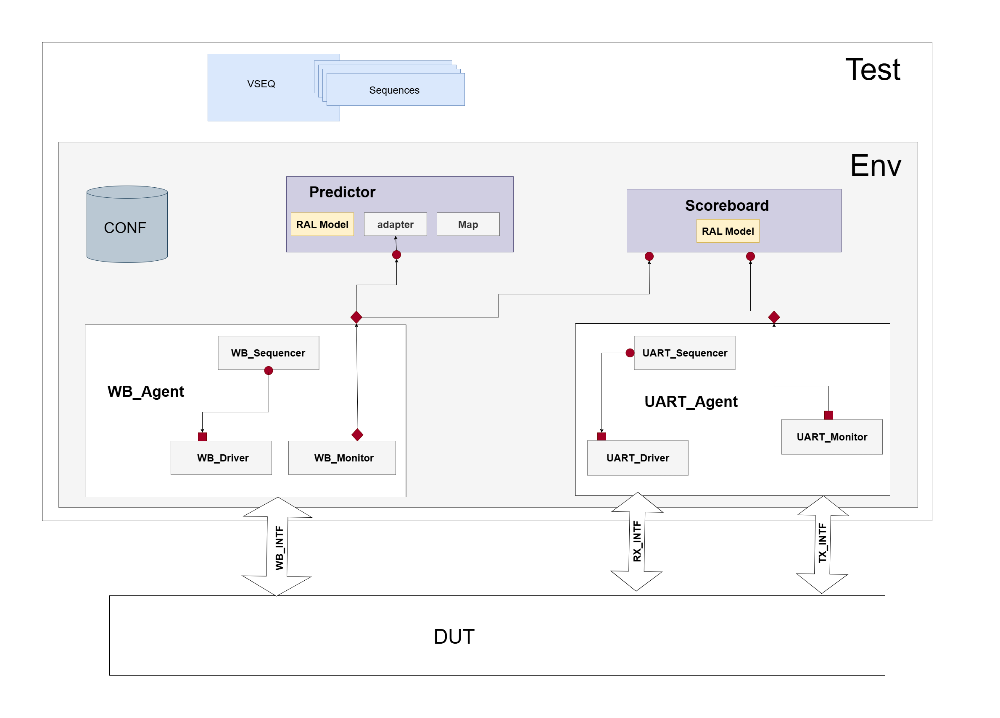

# UART_Verification
UVM-based Verification for UART 16550 with Wihsbone Interface IP

### Project Overview
This project implements a Universal Verification Methodology (UVM) environment to verify the functionality of the UART 16550 core with a Wishbone interface.
The UART 16550 core is widely used in embedded systems for serial communication, and this environment provides a reusable and scalable testbench for functional verification.

The DUT (Design Under Test) is the **[UART 16550 IP core](https://github.com/freecores/uart16550/tree/master)** developed and maintained by **OpenCores**. 

### Environment Architecture
Below is a high-level diagram of the UVM environment (replace with your actual architecture diagram):  

 ### Environemnt Features 
- Register Abstraction Layer (RAL) support for **backdoor and frontdoor accesses**  
- Constrained-random stimulus generation  
- Coverage-driven verification  
- Configurable **baud rate, parity, stop bits, and word length**  
- Support for **Wishbone protocol transactions**  
- Reset and **basic smoke tests** included  
- Easily extendable for **regression suites**  

### Getting Started

1. Prerequisites
SystemVerilog simulator with UVM support (e.g., Mentor Questa)
UVM library (IEEE 1800.2-2020 compliant)

2. Clone the Repository
git clone https://github.com/MoMoUsama/UART_Verification
UART_Verification

3. Compile & Run Simulation
With Makefile:
with a simulator-specific command (example for Questa):
do run.do

### Tests
The environment provides several tests:
Smoke Test – Sanity check after reset and register reads.
Configuration Test – Randomized configurations (baud rate, stop bits, parity).
Data Transmission Test – TX/RX data path verification.
Interrupt Test – Interrupt enable/disable functionality.
Wishbone Protocol Test – Validates DUT Wishbone compliance.
You can create new tests by extending uart_base_test.

### Acknowledgements
UART 16550 Core: Developed and maintained by OpenCores
Thanks to the open-source hardware community for providing reusable cores and verification resources.

